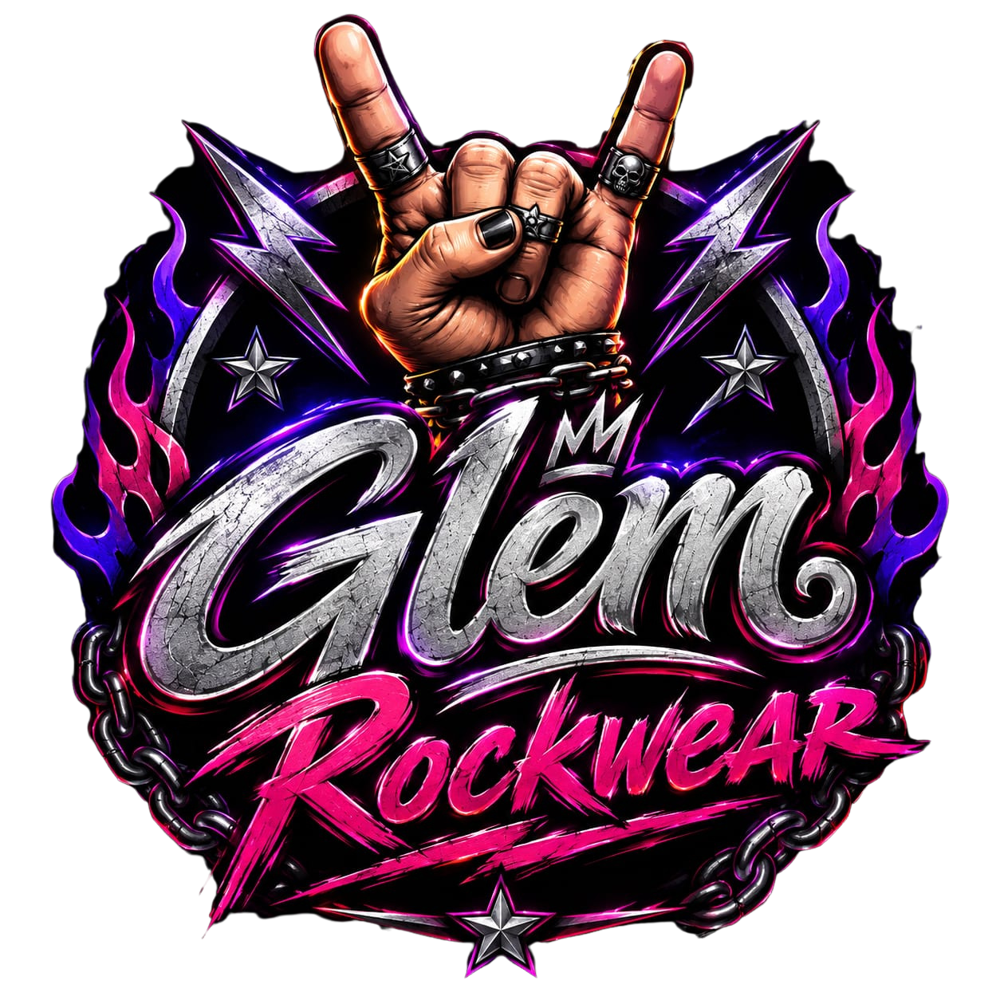

# 🎸 GLEM Rockwear

> **ROCK É ATITUDE.**

A **GLEM Rockwear** é uma loja virtual de roupas e acessórios inspirados na cultura Rock, desenvolvida como projeto de programação para colocar em prática conceitos de **desenvolvimento Web, APIs, integração Frontend/Backend, gerenciamento de carrinho e criação de pedidos**.

O projeto simula uma experiência de e-commerce, permitindo que o usuário navegue pelos produtos, filtre por categorias, pesquise itens, adicione produtos ao carrinho e envie um pedido para o Backend.

## 👥 Equipe

| Integrante | Função | Responsabilidades |
|---|---|---|
| **Eduardo Franceschetti Borges** | Tech Lead / Full Stack | Arquitetura, Frontend, Backend, API e integração |
| **MARIA VITÓRIA BRITO FOESCH** | Canvas e organizador de produtos (fotos e afins) lider |
| **GABRIELI CAROLINE SCHERER** | Canvas e organizador de produtos slides sub-lider |
| **LORENZZO SAMPAIO** | Canvas, Organizador de produtos (fotos e afins) Gerente |
| **MARIA EDUARDA DE ANDRADE SILVA** | Canvas Organizador de produtos (fotos e afins) Sub-Gerente |

---

# 📋 Sobre o projeto

A GLEM Rockwear foi desenvolvida utilizando uma arquitetura simples de **Frontend + Backend**, com o objetivo de praticar conceitos utilizados no desenvolvimento de aplicações Web.

Atualmente o sistema possui:

- 🏠 Página inicial
- 👕 Catálogo de produtos
- 🔎 Busca de produtos
- 🏷️ Filtro por categoria
- 🛒 Carrinho de compras
- ➕ Adição de produtos ao carrinho
- ➖ Remoção de produtos do carrinho
- 💰 Cálculo automático do total
- 📦 Criação de pedidos
- 🔌 API REST com FastAPI
- 💾 Persistência dos dados utilizando JSON
- 🔄 Comunicação entre Frontend e Backend
- 🌐 Configuração de CORS
- 📱 Interface responsiva
- 🧭 Navegação entre seções
- ⚡ Carregamento dinâmico dos produtos

---

# 🛠️ Tecnologias utilizadas

## Frontend

- HTML5
- CSS3
- JavaScript
- Fetch API
- DOM Manipulation
- HTML `<dialog>`
- Responsive Design

## Backend

- Python
- FastAPI
- Pydantic
- Uvicorn
- CORS

## Banco de dados

Atualmente o projeto utiliza arquivos **JSON** para armazenar os dados.

### Produtos

database
produtos.json

O arquivo contém informações como:

ID
Nome
Descrição
Cor
Categoria
Preço
Imagem

Exemplo de produto:

### json

{
    "id": 1,
    "nome": "Mochila de Rock",
    "descricao": "Mochila de Rock masculina",
    "cor": "preto",
    "categoria": "mochilas",
    "preco": 79.99,
    "imagem": "URL_DA_IMAGEM"
}

O catálogo atualmente possui produtos distribuídos entre categorias como mochilas, camisetas, acessórios e calçados.

🏗️ Estrutura do projeto

Loja_GLEM/
│
├── backend/
│   └── main.py
│
├── database/
│   ├── produtos.json
│   └── pedidos.json
│
├── images/
│   └── logo.jpeg
│
├── index.html
│
└── README.md

⚙️ Backend

O Backend foi desenvolvido utilizando FastAPI.

A API é responsável por:

Disponibilizar os produtos
Filtrar produtos por categoria
Receber pedidos
Calcular o valor total do pedido
Gerar ID do pedido
Salvar os pedidos no banco JSON

🔌 API
GET /produtos

Retorna todos os produtos cadastrados.

<-> html

GET http://127.0.0.1:8000/produtos

GET /produtos?categoria=

Permite filtrar os produtos por categoria.

Exemplo:

<-> http

GET http://127.0.0.1:8000/produtos?categoria=camisetas

O Backend compara a categoria recebida com a categoria cadastrada nos produtos, ignorando diferenças entre letras maiúsculas e minúsculas.

Exemplos:

camisetas
jaquetas
calças
calçados
acessorios
mochilas

📦 Pedidos

O sistema também possui uma rota para criação de pedidos.

<-> http

POST /pedidos

O pedido recebe uma lista de produtos:

{} json

{
    "produtos": [
        {
            "id": 1,
            "preco": 79.99
        },
        {
            "id": 2,
            "preco": 89.99
        }
    ]
}

O Backend então:

1. Abre o banco de pedidos
2. Obtém os pedidos existentes
3. Cria um novo ID
4. Calcula o valor total
5. Cria o pedido
6. Define o status como pendente
7. Adiciona o pedido ao banco
8. Salva novamente o arquivo JSON
9. Retorna o pedido criado

A estrutura atual do pedido contém id, produtos, total e status.

🛒 Sistema de Carrinho

O Frontend possui um sistema de carrinho desenvolvido em JavaScript.

O carrinho permite:

Adicionar produto

Ao clicar em: 🛒 COMPRAR

o produto é adicionado ao carrinho.

Remover produto

O usuário pode remover individualmente produtos adicionados.

Contador

O botão do carrinho mostra a quantidade de itens:

🛒 3

Total

O sistema calcula automaticamente o valor total:

Total: R$ 253,97

Carrinho vazio

Quando não existem produtos:

Seu carrinho está vazio

Adicione alguns produtos para começar.

🔎 Sistema de busca

A página possui um campo de pesquisa:

🔍 Buscar produtos...

A pesquisa é realizada em tempo real.

Conforme o usuário digita, os cards de produtos são filtrados pelo nome.

Exemplo:

Usuário digita:

bota

O sistema mantém apenas os produtos cujo nome contém:

🏷️ Sistema de categorias

A página possui categorias de produtos:

👕 Camisetas
🧥 Jaquetas
👖 Calças
🥾 Calçados
☠️ Acessórios
🎒 Mochilas

Ao clicar em uma categoria, o Frontend envia uma requisição para a API:

/produtos?categoria=camisetas

e atualiza a vitrine somente com os produtos daquela categoria.

🔄 Sistema "Ver Todos"

Depois de selecionar uma categoria, o usuário pode retornar para a lista completa de produtos através do botão:

VER TODOS →

O comportamento esperado é:

Todos os produtos
       ↓
Usuário seleciona "Camisetas"
       ↓
Somente camisetas
       ↓
Usuário clica em "VER TODOS"
       ↓
Todos os produtos novamente

Isso permite que o usuário saia facilmente de um filtro sem precisar atualizar a página.

🖼️ Vitrine de produtos

Os produtos não ficam escritos diretamente no HTML.

O JavaScript consulta a API:

fetch("http://127.0.0.1:8000/produtos")

Depois os produtos recebidos são transformados dinamicamente em cards.

Cada card possui:

Imagem
Nome
Categoria
Preço
Botão COMPRAR

Isso permite adicionar novos produtos ao produtos.json sem precisar criar manualmente novos cards no HTML.

🌐 Comunicação Frontend ↔ Backend

A comunicação entre as duas partes acontece através de requisições HTTP.

              GLEM Rockwear
                    │
                    ▼
             ┌──────────────┐
             │   Frontend   │
             │ HTML/CSS/JS  │
             └──────┬───────┘
                    │
                  Fetch
                    │
                    ▼
             ┌──────────────┐
             │   FastAPI    │
             │   Backend    │
             └──────┬───────┘
                    │
                    ▼
             ┌──────────────┐
             │    JSON      │
             │   Database   │
             └──────────────┘

🔐 CORS

O Backend possui configuração de CORS, permitindo que o Frontend consiga realizar requisições para a API.

Configuração atual:

app.add_middleware(
    CORSMiddleware,
    allow_origins=["*"],
    allow_credentials=True,
    allow_methods=["*"],
    allow_headers=["*"],
)

📱 Responsividade

A interface foi desenvolvida para funcionar em diferentes tamanhos de tela.

O CSS possui breakpoints para:

💻 Desktop
💻 Notebook
📱 Tablet
📱 Smartphone

A quantidade de colunas dos produtos e categorias é alterada de acordo com o tamanho da tela.

🧭 Navegação

O site possui navegação entre:

INÍCIO
PRODUTOS
CATEGORIAS
SOBRE NÓS
CONTATO

A navegação utiliza:

Anchor links
JavaScript
Scroll suave
Atualização automática do menu
Hash da URL
Detecção da seção atual durante o scroll

O menu também destaca a seção atualmente selecionada.

💳 Pagamento

Atualmente o sistema possui uma etapa de pagamento simulado.

Ao clicar:

FINALIZAR COMPRA

o sistema verifica se o carrinho possui produtos e apresenta o valor total.

⚠️ Importante

O pagamento ainda não é real.

Não existe integração atual com API do:

Mercado Pago
Stripe
PagSeguro
PIX
Cartão de crédito

Essa parte poderá ser implementada futuramente.

Sentiram falta do Login e registro?

Essa parte precisaria de:

Criptografia(hashlib usada pras senhas ou uma mais popular como a Cryptography), banco de dados incrementavel: SQL usando um dbeaver. Um CRUD (CREATE, READ, UPDATE e DELETE). segurança em informações pessoais se tivesse CPF. teria que ser criptografado então optamos por deixar de fora do projeto!

▶️ Como executar o projeto?

1. Instalar as dependências

No terminal:

pip install fastapi uvicorn pydantic

2. Iniciar o Backend

Na pasta raiz do projeto:

execute:

python -m uvicorn backend.main:app --reload

O Backend ficará disponível em:

http://127.0.0.1:8000

3. Testar a API

Produtos:

http://127.0.0.1:8000/produtos

Documentação automática do FastAPI:

http://127.0.0.1:8000/docs

4. Abrir o Frontend

Abra o:

index.html

em um navegador ou utilize um servidor local, como o Live Server do VS Code.

📚 Objetivos de aprendizado

O projeto está sendo utilizado para praticar conceitos importantes de programação e desenvolvimento Web.

Python

Funções
Classes
Pydantic
Manipulação de JSON
Estruturas de repetição
Listas
Condições
APIs

FastAPI

Rotas
GET
POST
Query Parameters
Request Body
Models
CORS
Uvicorn

JavaScript

Funções
Arrays
Eventos
DOM
fetch()
async/await
Requisições HTTP
Manipulação dinâmica de HTML
local state do carrinho

Frontend

HTML semântico
CSS
Grid
Flexbox
Responsividade
Modais
Navegação
Componentização visual

🚀 Próximos passos

O projeto ainda está em desenvolvimento.

Algumas funcionalidades planejadas:

 Sistema de usuários
 Login e cadastro
 Autenticação
 JWT
 Perfil do usuário
 Histórico de pedidos
 Página individual do produto
 Sistema de estoque
 Quantidade de produtos no carrinho
 Persistência do carrinho
 Checkout
 Integração com pagamento real
 PIX
 Cartão de crédito
 Banco de dados SQL
 Painel administrativo
 Cadastro de produtos
 Edição de produtos
 Exclusão de produtos
 Gerenciamento de pedidos
 Controle de estoque
 Deploy do Backend
 Deploy do Frontend

 🧱 Arquitetura atual

Atualmente:

Frontend
│
├── HTML
├── CSS
└── JavaScript
        │
        │ HTTP / Fetch
        ▼
Backend
│
└── FastAPI
        │
        ▼
Database
│
├── produtos.json
└── pedidos.json

Futuramente a arquitetura poderá evoluir para:

Frontend
│
└── React / Vue
        │
        ▼
API
│
└── FastAPI
        │
        ├── Autenticação
        ├── Produtos
        ├── Carrinho
        ├── Pedidos
        ├── Usuários
        └── Pagamentos
                │
                ▼
            Database
                │
                └── PostgreSQL

🎯 Status do projeto

🟢 Em desenvolvimento

Atualmente funcionando
✅ Página inicial
✅ Catálogo
✅ Produtos carregados pela API
✅ Filtro por categoria
✅ Busca
✅ Carrinho
✅ Adicionar produtos
✅ Remover produtos
✅ Contador do carrinho
✅ Cálculo do total
✅ Criação de pedidos
✅ Banco JSON
✅ FastAPI
✅ CORS
✅ Layout responsivo
✅ Navegação entre seções

🎸 GLEM Rockwear

Mais que roupa. Atitude.

Projeto desenvolvido para estudos e prática de desenvolvimento Web.

ROCK É IDENTIDADE.
